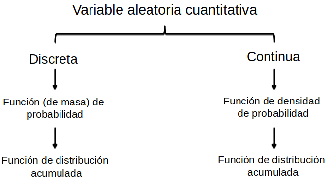
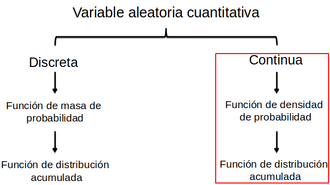
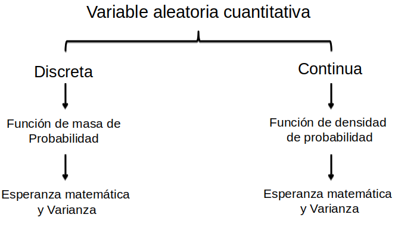
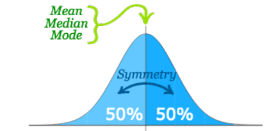
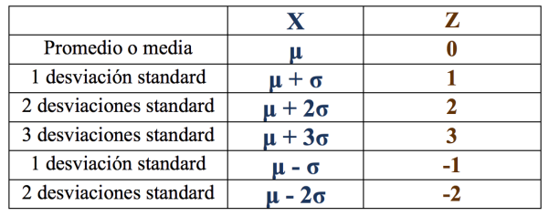

```{r setup, include=FALSE}
options(htmltools.dir.version = FALSE)
```

```{r xaringan-themer, include=FALSE}
library(xaringanthemer)
# solarized_dark(
#   code_font_family = "Fira Code",
#   code_font_url    = "https://cdn.rawgit.com/tonsky/FiraCode/1.204/distr/fira_code.css",
#   text_bold_color = "#af241a"
# )
duo_accent(
  primary_color = "#006747", 
  secondary_color = "#CFC493",
  code_font_family = "Fira Code",
  code_font_url    = "https://cdn.rawgit.com/tonsky/FiraCode/1.204/distr/fira_code.css")
  #text_bold_color = "#af241a")

```

background-image: url(gifs/lets_start.gif)
---
class: center, middle

# Dinámica de la clase

---

# Datos utilizados

> Se utilizarán datos `reales` para los ejemplos y todos los análisis se presentarán utilizando código en `R`. El alumno puede `reproducir` los ejemplos de clase siguiendo el mismo orden.


- Datos de `precipitación` mensual en la estación Maquehue (Temuco) entre 1950-2018.

- Datos de `temperatura promedio mensual` en estación Quinta Normal (Santiago) entre 1975-2017.

---

# Cargamos los datos

```{r,echo=TRUE}
set.seed(123)
temp <- tempfile(fileext = ".zip")
download.file("https://drive.google.com/uc?authuser=0&id=1EiZriFacTOys4I2gK6xgifYUY_MEe9_s&export=download",temp)
out <- unzip(temp, exdir = tempdir())
datPrec <- read.csv2(out[1]) #importa datos de precipitación
datTempQN <- read.csv2(out[3]) #importa datos temperatura
```
---
class: center, middle

# Resumen clase anterior

---

# Temas vistos

### Distribución de probablidades

.center[

]

---
# Temas vistos

### Función de masa de probablidades (var. discreta)
```{r,echo=TRUE,fig.width=10,fig.height=4.5}
par(mfrow=c(1,2))
k <- c(1:30)
plot(k,dbinom(k,size=30,prob=.5),type="h",main="Probabilidad de obtener cara \n con una moneda lanzada 30 veces",xlab="Numero de ensayos",ylab="Probabilidad")
plot(k,dbinom(k,size=30,prob=1/6),type="h",main="Probabilidad de obtener 2 al\n lanzar un dado 30 veces",xlab="Numero de ensayos",ylab="Probabilidad")
par(mfrow=c(1,1))
dbinom(k,size=30,prob=.15)
```
---
# Temas vistos

### Distribución de probablidades

.center[

]
---
# Temas vistos

### Función de densidad de probabilidades (var. continua)
```{r,echo=TRUE,fig.width=10,fig.height=5}
hist(datTempQN$Dec,prob=TRUE,main='Temperatura promedio mes de diciembre',xlab='Temperatura (Celsius)',ylab='Probabilidad')
lines(density(datTempQN$Dec),col='red',type='l')
```

---
# Temas vistos

### Función de distribución acumulada (var. continua)
```{r,echo=TRUE,fig.width=10,fig.height=5}
plot(ecdf(datTempQN$Dec),main='ECDF',xlab='Temperatura (Celsius)')
```
---

# Temas vistos

### Distribución de probablidades

.center[

]
---
# Temas vistos

### Población y muestra

.center[

]

---
# Temas vistos

### Parámetros y estadísticos

- **Parámetro:** Son las medidas o características descriptivas inherentes a las `poblaciones`. Resume los valores de algún atributo (variables) de la `población`. 

Es un valor único.

- **Estadístico:** Son las medidas descriptivas inherentes a una muestra, las cuales pueden usarse como estimación del parámetro. 

No tiene un valor único, varía de una muestra a otra.
---
class: center, middle

# Overview

### ¿Qué veremos?

---

# Temas

- Teorema Central de Límite (TCL)

- Distribución normal $(X\sim N(\mu,\sigma))$

- Distribución Normal estandarizada $(X\sim N(0,1))$

---
class: center, middle

# Teorema Central de Límite

---
# Teorema

**Definición:**

En teoría de la probabilidad, el `teorema central de límite (TCL)` establece que, en algunas situaciones, cuando se `agregan variables aleatorias independientes`, esta tiende hacia una distribución normal ("curva de campana") incluso si las variables originales no siguen distribución normal. El teorema es un concepto `clave` en la teoría de la probabilidad porque implica que los métodos probabilísticos y estadísticos que funcionan para las distribuciones normales pueden `ser aplicables a muchos problemas` que involucran otros tipos de distribuciones.

> Si tomamos muestras de tamaño `n` suficientemente grande en un población y calculamos el promedio de cada una de las muestras, no importa la forma de la distribución original de la población, la `distribución de promedios` seguirá una `distribución normal`.

---

# Ejemplo Teorema Centra de Límite

`Población:` precipitación mensual entre 1950 a 2018 (757 meses)

```{r,echo=TRUE,fig.width=10,fig.height=5}
barplot(datPrec$PP,names.arg=datPrec$dates)
```
---

# Ejemplo Teorema Centra de Límite

Precipitación mensual sigue distribución gamma/pearson-3

```{r,echo=TRUE,fig.width=10,fig.height=5}
hist(datPrec$PP,prob=TRUE,main='Histograma y funcion de densidad de precipitacion mensual',xlab='Precipitacion mensual (mm)') #grafica histograma
lines(density(datPrec$PP),col='red')
```
---
# Ejemplo Teorema Centra de Límite

`Muestra:` promedio de 30 meses en la población.
30 repeticiones

```{r,echo=TRUE,fig.width=10,fig.height=5}
mu <- c() # crea vector vacio
for (i in 1:30){
  mu[i] <-mean(sample(datPrec$PP,30),replace=FALSE)
}

```
---
# Ejemplo Teorema Centra de Límite

30 repeticiones
```{r,echo=TRUE,fig.width=10,fig.height=5}
hist(mu,xlab='Precipitacion promedio mensual',ylab='Probabilidad',prob=TRUE,main='')
lines(density(mu),col='red')
```
---
# Ejemplo Teorema Central de Límite

100 repeticiones

```{r,echo=TRUE,fig.width=10,fig.height=5}
mu <- c() # crea vector vacio
for (i in 1:100){
  mu[i] <-mean(sample(datPrec$PP,30),replace=FALSE)
}
```
---
# Ejemplo Teorema Central de Límite

100 repeticiones
```{r,echo=TRUE,fig.width=10,fig.height=5}
hist(mu,xlab='Precipitacion promedio mensual',ylab='Probabilidad',prob=TRUE,main='')
lines(density(mu),col='red')
```
---
# Ejemplo Teorema Central de Límite

1000 repeticiones

```{r,echo=TRUE,fig.width=10,fig.height=5}
mu <- c() # crea vector vacio
for (i in 1:1000){
  mu[i] <-mean(sample(datPrec$PP,30),replace=FALSE)
}
```
---
# Ejemplo Teorema Central de Límite

1000 repeticiones
```{r,echo=TRUE,fig.width=10,fig.height=5}
hist(mu,xlab='Precipitacion promedio mensual',ylab='Probabilidad',prob=TRUE,main='')
lines(density(mu),col='red')
```
---
# Ejemplo Teorema Central de Límite

`Conclusión:` 

> La distribución original de los datos puede tener cualquier distribución, sin embargo el histograma de los promedios de muestras de tamaño n siempre será normal.

**Material comlementario:** Aplicación dinámica que permite entender el concepto del Teorema Central de Límite.

https://tuomonieminen.shinyapps.io/CLTdemo/

---
class: center, middle

# Distribución normal 

---
# ¿Qué es?

```{r,echo=TRUE,fig.width=10,fig.height=5.5}
set.seed(1234) #setea semilla aleatorización
simNorm <- rnorm(1000,10,2) #valores simulados distribución normal
hist(simNorm,main='Histograma Distribucion Normal',prob=TRUE,xlab='valores',ylab='Densidad') #gráfica histograma
lines(density(simNorm),col='red')
```
---
# ¿Qué es?

> La  distribución  de  probabilidad  conocida  como  `distribución  normal`  es,  por  la  cantidad  de  fenómenos que explica, `la más importante` de las distribuciones estadísticas. 

- La `distribución normal`, también conocida como la distribución Gaussiana (`forma de campana`), es una distribución de probabilidad que es simétrica con respecto a la media.

- Los datos en torno a la `media` son más `frecuentes` en comparación a los que están `alejados ` de la `media`.

- Permite modelar un gran número `fenómenos naturales`.

- Por otro lado, en virtud del `teorema del límite central`, casi cualquier distribución de probabilidad, se puede `aproximar a una normal` bajo ciertas condiciones.

---

# Definiciones

- Una variable aleatoria `continua, X`, sigue una distribución normal de media $\mu$ y desviación estandar $\sigma$, y se designa por $X \sim N(\mu,\sigma)$, si se cumplen las siguientes condiciones:

1. La variable puede tomar cualquier valor: $(-\infty, +\infty)$ y

2. Su función de densidad se pueda describir por:

$$f(x) = \frac{e^{-\frac{1}{2}\big(\frac{x-\mu}{\sigma}\big)^2}}{\sigma\sqrt{2\pi}}$$

$x:$ variable aleatoria continua,  
$\mu:$ media o esperanza de `x`,  
$\sigma:$ varianza de `x`


---
# Histograma

```{r,echo=TRUE,fig.width=10,fig.height=5.5}
hist(simNorm,main='Histograma Distribucion Normal',xlab='valores',ylab='Frecuencia') #gráfica histograma
```
---
# Función de densidad de probabilidades

```{r,echo=TRUE,fig.width=10,fig.height=5.5}
plot(density(simNorm),type='l',main='Histograma Distribucion Normal',xlab='valores',ylab='Frecuencia') #gráfica histograma
text(4, 0.15, expression(f(x) == frac(e^-frac(1,2)(frac(x-mu,sigma))^2,sigma*sqrt(2*pi))),cex=2)
```

---
# Propiedades de la distribución normal

1. Su esperanza (media) es $\mu$.

2. Su varianza es $\sigma^2$, y su desviacion estandar es $\sigma$.

3. Es simétrica respecto a su media ($\mu$).

4. Media = moda = mediana 

5. La probabilidad total equivale al área encerrada bajo la curva.

.center[

]
---
# Propiedades de la distribución normal

Recordemos que la $\sigma$ es una medida de cómo están distribuidos los datos. Podemos caracterizar la distribución de probabilidad en entorno de la $\mu$:

- Alrededor del `68%` de las observaciones está dentro de `1 desviaciones estándar` de la `media`.

- Alrededor del `95%` de las observaciones está dentro de `1.96 desviaciones estándar` de la `media`.

- Alrededor del `99.7%` de las observaciones está dentro de `3 desviaciones estándar` de la `media`.

.center[

]

---
#Ejemplo 

### Temperatura media mensual Quinta Normal mes de abril

```{r,echo=TRUE,fig.width=10,fig.height=5.5}
hist(datTempQN$Apr,main='Histograma Temperatura media mensual abril',prob=TRUE,xlab='Temperatura (°C)',ylab='Densidad') #gráfica histograma
lines(density(datTempQN$Apr),col='red')
```

---
#Ejemplo 

### Temperatura media mensual Quinta Normal mes de abril

Promedio, mediana y desviación estandar
```{r,echo=TRUE,fig.width=10,fig.height=5.5}
mu <- mean(datTempQN$Apr) #valor promedio
print(mu)
mediana <- median(datTempQN$Apr) #valor de la mediana
print(mediana)
de <- sd(datTempQN$Apr) #desviación estandar
print(de)

```

---
#Ejemplo 

### Temperatura promedio mensual Quinta Normal mes de abril

```{r,echo=TRUE,fig.width=10,fig.height=3.5,fig.show='hide'}
hist(datTempQN$Apr,main='Histograma Temperatura promedio mensual abril',prob=TRUE,xlab='Temperatura (Celsius)',ylab='Densidad') #gráfica histograma
lines(density(datTempQN$Apr),col='lightgray')
abline(h = 0, v = mu, col = "red",lty=3)
abline(h = 0, v = mediana, col = "blue",lty=3)
abline(h = 0, v = mu+de, col = "darkgreen",lty=3)
abline(h = 0, v = mu-de, col = "darkgreen",lty=3)
text(mu-de,0.6,bquote(paste(mu-sigma,'=',.(round(mu-de,1)))),adj=c(1,0))
text(mu+de,0.6,bquote(paste(mu+sigma,'=',.(round(mu+de,1)))),adj=c(-0.2,0))
text(mu,0.7,bquote(paste(mu,'=',.(round(mu,1)))),adj=c(-0.2,0))
text(mediana,0.6,bquote(paste(tilde(x),'=',.(round(mediana,1)))),adj=c(-0.2,0))
```
---
#Ejemplo 

### Temperatura promedio mensual Quinta Normal mes de abril

```{r,echo=FALSE,fig.width=10,fig.height=5}
hist(datTempQN$Apr,main='Histograma Temperatura promedio mensual abril',prob=TRUE,xlab='Temperatura (Celsius)',ylab='Densidad') #gráfica histograma
lines(density(datTempQN$Apr),col='lightgray',lwd=3)
abline(v = mu, col = "red",lty=3,lwd=3)
abline(v = mediana, col = "blue",lty=3,lwd=3)
abline(v = mu+de, col = "darkgreen",lty=3,lwd=3)
abline(v = mu-de, col = "darkgreen",lty=3,lwd=3)
text(mu-de,0.6,bquote(paste(mu-sigma,'=',.(round(mu-de,1)))),adj=c(1,0))
text(mu+de,0.6,bquote(paste(mu+sigma,'=',.(round(mu+de,1)))),adj=c(-0.2,0))
text(mu,0.7,bquote(paste(mu,'=',.(round(mu,1)))),adj=c(-0.2,0))
text(mediana,0.6,bquote(paste(tilde(x),'=',.(round(mediana,1)))),adj=c(-0.2,0))
```
---
#Ejemplo

### Temperatura promedio mensual Quinta Normal mes de abril

¿Qué nos dise la distribución de probabilidades normal?

- El valor `más esperado` de temperatura promedio mensual en abril es `r round(mu,1)`°C.

- El `50%` de las temperaturas promedio para abril son `menores a` `r mediana`°C

- El `50%` de las temperaturas promedio para abril son `mayores a` `r mediana`°C

- El `68%` de los valores de temperatura promedio en abril se encuentran entre `r round(mu-de,1)`°C y `r round(mu+de,1)`°C

- El `95%` de los valores de temperatura promedio en abril se encuentran entre `r round(mu-1.96*de,1)`°C y `r round(mu+1.96*de,1)`°C
---
#Ejemplo

### Temperatura promedio mensual Quinta Normal mes de abril

```{r,echo=TRUE,fig.width=10,fig.height=4.5}
hist(datTempQN$Apr,main='Histograma Temperatura promedio mensual Abril',prob=TRUE,xlab='Temperatura (Celsius)',ylab='Densidad') #gráfica histograma
lines(density(datTempQN$Apr),col='red')
lines(density(rnorm(100,mean(datTempQN$Apr),sd(datTempQN$Apr))),col='blue')
legend(12.3,0.6, legend=c("Densidad temperatura", "Densidad Simulada"),col=c("red","blue"), lty=1:2, cex=0.8)
```

---
class: center, middle

# Distribución normal  estandarizada

---
# Definiciones

- La distribución normal estandarizada es una distribución normal con $\mu = 0$ y $\sigma= 1$.

> Si $x$ es una observación (valor) de una distribución normal con media $\mu$ y desviación estándar $\sigma$, el valor estándar de $x$ es:

$$ z=\frac{x-\mu}{\sigma}$$

Este valor estándar también se le conoce como `valor-z`.

- El `valor-z` nos indica a cuantas $\sigma$ está la observación original $x$ en relación a la $\mu$ y en que dirección.

---
# Histograma y función de densidad de probabilidades

```{r,echo=TRUE,fig.width=10,fig.height=5,fig.show='hide'}
hist(rnorm(1000),xlab='valor-z',ylab='Probabilidad',prob=TRUE)
lines(density(rnorm(1000)),col='red')
abline(v = 0, col = "red",lty=3)
abline(v = 0, col = "blue",lty=3)
abline(v = 1, col = "darkgreen",lty=3)
abline(v = -1, col = "darkgreen",lty=3)
text(mu-de,0.6,bquote(paste(mu-sigma,'=',.(round(mu-de,1)))),adj=c(1,0))
text(mu+de,0.6,bquote(paste(mu+sigma,'=',.(round(mu+de,1)))),adj=c(-0.2,0))
text(mu,0.7,bquote(paste(mu,'=',.(round(mu,1)))),adj=c(-0.2,0))
text(mediana,0.6,bquote(paste(tilde(x),'=',.(round(mediana,1)))),adj=c(-0.2,0))
```
---
# Histograma y función de densidad de probabilidades

```{r,echo=FALSE,fig.width=10,fig.height=5}
hist(rnorm(1000),main='Distribucion normal estandarizada',xlab='valor-z',ylab='Probabilidad',prob=TRUE)
lines(density(rnorm(1000)),col='red')
abline(v = 0, col = "red",lty=3,lwd=3)
abline(v = 0, col = "blue",lty=3,lwd=3)
abline(v = 1, col = "darkgreen",lty=3,lwd=3)
abline(v = -1, col = "darkgreen",lty=3,lwd=3)
text(-1,0.34,bquote(paste(mu-sigma,'=',-1)),adj=c(1,0))
text(1,0.34,bquote(paste(mu+sigma,'=',1)),adj=c(-0.2,0))
text(0,0.3,bquote(paste(mu,'=',0)),adj=c(-0.2,0))
text(0,0.34,bquote(paste(tilde(x),'=',0)),adj=c(-0.2,0))
```
---
# Equivalencia normal estandarizada

Los valores de la variable aleatoria continua $x$ tienen las siguientes equivalencia con eñ `valor-z` de acuerdo a su $\mu$ y $\sigma$, independiente del valor que sean.

.center[

]
---
# Ejemplo

### Temperatura promedio mensual en Quinta Normal.

$$ z=\frac{x-\mu}{\sigma}$$

```{r echo=TRUE}
datEst <- data.frame(x=datTempQN$Apr,z=(datTempQN$Apr-mu)/de) #datos observado y estandarizados
head(datEst)
```
---
# Ejemplo

### Temperatura promedio mes de abril en Quinta Normal

```{r echo=TRUE,fig.height=5,fig.show='hide'}
datEst <- data.frame(x=datTempQN$Apr,z=(datTempQN$Apr-mu)/de) #datos observado y estandarizados
plot(density(datEst$x),type='l')
abline(v = mu, col = "red",lty=3,lwd=3)
abline(v = mediana, col = "blue",lty=3,lwd=3)
abline(v = mu+de, col = "darkgreen",lty=3,lwd=3)
abline(v = mu-de, col = "darkgreen",lty=3,lwd=3)
text(mu-de,0.6,bquote(paste(mu-sigma,'=',.(round(mu-de,1)))),adj=c(1,0))
text(mu+de,0.6,bquote(paste(mu+sigma,'=',.(round(mu+de,1)))),adj=c(-0.2,0))
text(mu,0.7,bquote(paste(mu,'=',.(round(mu,1)))),adj=c(-0.2,0))
text(mediana,0.6,bquote(paste(tilde(x),'=',.(round(mediana,1)))),adj=c(-0.2,0))
```
---
# Ejemplo

### Temperatura promedio mes de abril en Quinta Normal

```{r echo=FALSE,fig.height=6,fig.width=10}
datEst <- data.frame(x=datTempQN$Apr,z=(datTempQN$Apr-mu)/de) #datos observado y estandarizados
plot(density(datEst$x),type='l',xlab='Temperatura (celsius)',ylab='Probabilidad',main='')
abline(v = mu, col = "red",lty=3,lwd=3)
abline(v = mediana, col = "blue",lty=3,lwd=3)
abline(v = mu+de, col = "darkgreen",lty=3,lwd=3)
abline(v = mu-de, col = "darkgreen",lty=3,lwd=3)
text(mu-de,0.6,bquote(paste(mu-sigma,'=',.(round(mu-de,1)))),adj=c(1,0))
text(mu+de,0.6,bquote(paste(mu+sigma,'=',.(round(mu+de,1)))),adj=c(-0.2,0))
text(mu,0.7,bquote(paste(mu,'=',.(round(mu,1)))),adj=c(-0.2,0))
text(mediana,0.6,bquote(paste(tilde(x),'=',.(round(mediana,1)))),adj=c(-0.2,0))
```
---
# Ejemplo

### Temperatura promedio mes de abril en Quinta Normal

```{r echo=FALSE,fig.height=6,fig.width=10}
datEst <- data.frame(x=datTempQN$Apr,z=(datTempQN$Apr-mu)/de) #datos observado y estandarizados
plot(density(datEst$z),type='l',xlab='valor-z',ylab='Probabilidad',main='')
abline(v = 0, col = "red",lty=3,lwd=3)
abline(v = round(median(datEst$z),1), col = "blue",lty=3,lwd=3)
abline(v = 1, col = "darkgreen",lty=3,lwd=3)
abline(v = -1, col = "darkgreen",lty=3,lwd=3)
text(-1,0.35,bquote(paste(mu-sigma,'=',-1)),adj=c(1,0))
text(1,0.35,bquote(paste(mu+sigma,'=',1)),adj=c(-0.2,0))
text(0,0.4,bquote(paste(mu,'=',0)),adj=c(-0.2,0))
text(round(median(datEst$z),1),0.35,bquote(paste(tilde(x),'=',0)),adj=c(-0.2,0))
```
---

# Utilidad de la distribución normal estandarizada

- Nos permite `comparar variables` en términos de su `variación` y `no` de su `magninut`.

- Si queremos comparar la temperatura promedio para abril de Quinta Normal ( $\mu=$ `r round(mu,1)`) con Aysén ( $\mu=10$ ).

- Ambas tienen magnitudes diferentes porque pertenece a distintas zonas climáticas.

- Transformando ambas a distribución normal estandarizada podemos saber cual a disminuido o aumentado más respecto a su media.

- Analizamos la probablidad que corresponde al área bajo la curva de la función de densidad de probabilidades.

---
# Estimación de la probabilidad (área bajo la curva)

¿Cuál es la probabilidad de que la temperatura promedio mensual de abril en Quinta Normal sea mayor de 15°C?

En `R`:

Sabemos que el $\mu=$ `r round(mu,1)` y que $\sigma=$ `r round(de,2)`

Utilizamos la función `pnorm`, nos entrega el área bajo la curva para valores de menores al valor deseado

```{r echo=TRUE}
p15 <- pnorm(15,mean=14.4,0.74)
print(p15)
```
---
# Estimación de la probabilidad (área bajo la curva)

¿Cuál es la probabilidad de que la temperatura promedio mensual de abril en Quinta Normal sea mayor de 15°C?

```{r echo=FALSE,fig.height=6,fig.width=10}
datEst <- data.frame(x=datTempQN$Apr,z=(datTempQN$Apr-mu)/de) #datos observado y estandarizados
plot(density(datEst$x),type='l',xlab='Temperatura (celsius)',ylab='Probabilidad',main='')
abline(v=15,col = "red",lty=3,lwd=3)
text(14,0.25,paste0(round(p15,3)*100,'%'),cex=2)
text(16,0.05,paste0(round(1-p15,3)*100,'%'),cex=2)
#abline(v = mu, col = "red",lty=3,lwd=3)
#abline(v = mediana, col = "blue",lty=3,lwd=3)
#abline(v = mu+de, col = "darkgreen",lty=3,lwd=3)
#abline(v = mu-de, col = "darkgreen",lty=3,lwd=3)
#text(mu-de,0.6,bquote(paste(mu-sigma,'=',.(round(mu-de,1)))),adj=c(1,0))
#text(mu+de,0.6,bquote(paste(mu+sigma,'=',.(round(mu+de,1)))),adj=c(-0.2,0))
#text(mu,0.7,bquote(paste(mu,'=',.(round(mu,1)))),adj=c(-0.2,0))
#text(mediana,0.6,bquote(paste(tilde(x),'=',.(round(mediana,1)))),adj=c(-0.2,0))
```
---
# Estimación de la probabilidad (área bajo la curva)

¿Cuánto es la temperatura promedio mensual para una probabilidad de excedencia de 20.9%?

Cómo sabemos que la función nos entrega el área bajo la curva desde $-\infty$, calculamos el complemento es decir, $1-0.209$

Así, queremos saber $P(X\leq0.791)$

```{r, echo=TRUE}
qnorm(0.791,mean=14.4,sd=0.74)
```
---
# Estimación de la probabilidad (área bajo la curva)

¿Cuánto es la temperatura promedio mensual para una probabilidad de excedencia de 20.9%?

```{r echo=FALSE,fig.height=6,fig.width=10}
datEst <- data.frame(x=datTempQN$Apr,z=(datTempQN$Apr-mu)/de) #datos observado y estandarizados
plot(density(datEst$x),type='l',xlab='Temperatura (celsius)',ylab='Probabilidad',main='')
abline(v=15,col = "red",lty=3,lwd=3)
text(14,0.25,paste0(round(p15,3)*100,'%'),cex=2)
text(16,0.05,paste0(round(1-p15,3)*100,'%'),cex=2)
#abline(v = mu, col = "red",lty=3,lwd=3)
#abline(v = mediana, col = "blue",lty=3,lwd=3)
#abline(v = mu+de, col = "darkgreen",lty=3,lwd=3)
#abline(v = mu-de, col = "darkgreen",lty=3,lwd=3)
#text(mu-de,0.6,bquote(paste(mu-sigma,'=',.(round(mu-de,1)))),adj=c(1,0))
#text(mu+de,0.6,bquote(paste(mu+sigma,'=',.(round(mu+de,1)))),adj=c(-0.2,0))
#text(mu,0.7,bquote(paste(mu,'=',.(round(mu,1)))),adj=c(-0.2,0))
#text(mediana,0.6,bquote(paste(tilde(x),'=',.(round(mediana,1)))),adj=c(-0.2,0))
```

---
background-image: url(gifs/end.gif)
